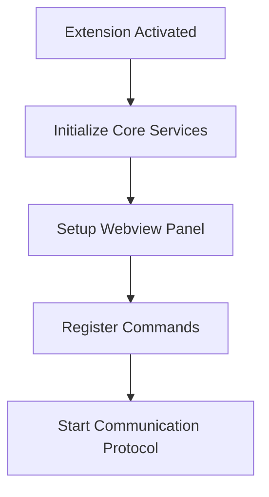

make a poc for making a vs code extension like copiolt , cursor , continue , gemini assistent for code , strictly use open ai compatability module so that in future i can change the llm and model ,  use , like import OpenAI from "openai";

const openai = new OpenAI({
    apiKey: "GEMINI_API_KEY",
    baseURL: "https://generativelanguage.googleapis.com/v1beta/openai/"
});

const response = await openai.chat.completions.create({
    model: "gemini-2.0-flash",
    messages: [
        { role: "system", content: "You are a helpful assistant." },
        {
            role: "user",
            content: "Explain to me how AI works",
        },
    ],
});

console.log(response.choices[0].message);
 but for embedding  apply button there will two model hard coded two file one ollama and other gemini ai 
 basically this 4 things i want 
text_analysis
Open a file, get code suggestions as you type, and press tab to accept

lightbulb_tips
Press cmd+i to ask Gemini to create or modify code

menu_book_spark
Select code in the editor to reveal additional Gemini actions, such as Explain Code

folder_spark
Pass in files to take advantage of Gemini Code Assist's generous context window with @file in chat

i want to build vs code chat extension which will have feature 

- generate code and it can handle the code in formate like chatgpt , gemini offer in a box and two button copy and paste , convert the code into codeblock like gpt , cursor , copilotly,
- in apply button , use llm tho code embeed so that new llm code can esaily apply  like using gemini or ollama "embeddingsProvider": {
    "provider": "ollama",
    "model": "nomic-embed-text:latest"
  }

  
- and file access , it also should support multiple file access and while accessing it should track input box and whenever user typoe `@` give option of drop down of all file of vs code workspace 

*strictly make multiple file so that one file don't have a long code 

I'll help you create a plan for building a VS Code extension similar to Continue's chatbot functionality. Based on the repository structure, here's a comprehensive plan:

# Project Structure and Flow

```plaintext
your-chatbot-extension/
├── core/                      # Core functionality
│   ├── config/               # Configuration management
│   ├── models/               # AI model integrations
│   ├── chat/                # Chat implementation
│   └── protocol/            # IDE-Core communication
├── gui/                      # React-based UI
│   ├── components/          # UI components
│   ├── contexts/           # React contexts
│   └── styles/             # CSS/styling
           # VS Code specific code
│       ├── src/            # Extension source
│       └── webview/        # Webview integration
└── scripts/                 # Build and utility scripts
```

# Implementation Flow

1. **Extension Initialization**


2. **Core Components**

- **Configuration Handler**
  - Manage user settings
  - Model configurations
  - API keys and endpoints

- **Chat Implementation**
  - Message handling
  - Context management
  - Code snippet integration
  - File system access

- **AI Integration**
  - Model communication
  - Response processing
  - Stream handling

3. **GUI Components**

- **Chat Interface**
  - Message display
  - Input handling
  - Code highlighting
  - File tree integration

4. **VS Code Integration**

- **Commands**
  - Open chat panel
  - Quick actions
  - Context menu integration

- **Webview Communication**
  - Message passing
  - State synchronization
  - File system access

# Key Files to Create

1. **Extension Entry Point**
```typescript:/Users/vashusingh/Downloads/continue-main/extensions/vscode/src/extension.ts
export function activate(context: vscode.ExtensionContext) {
    // Initialize core services
    // Register commands
    // Setup webview
}
```

2. **Webview Provider**
```typescript:/Users/vashusingh/Downloads/continue-main/extensions/vscode/src/ChatWebviewProvider.ts
class ChatWebviewProvider implements vscode.WebviewViewProvider {
    // Handle webview creation
    // Manage message passing
    // Handle state
}
```

3. **Core Protocol**
```typescript:/Users/vashusingh/Downloads/continue-main/core/protocol/ideProtocol.ts
interface IdeProtocol {
    // Define message types
    // Handle IDE-specific actions
    // Manage state synchronization
}
```


```

# Key Features to Implement

1. **Chat Interface**
- Message threading
- Code snippet support
- Syntax highlighting
- File references

2. **Context Management**
- Active file integration
- Workspace awareness
- Git integration
- Project structure understanding

3. **AI Integration**
- Model selection
- API communication
- Response streaming
- Error handling

4. **Developer Experience**
- Debug configurations
- Hot reload support
- Testing framework
- Documentation

This structure follows similar patterns to the Continue app, focusing on:
- Separation of concerns between core logic and UI
- Robust communication protocol
- Extensible architecture
- Developer-friendly tooling

The key difference is that this is focused specifically on the chat functionality while maintaining the same high-quality standards and architecture patterns seen in the Continue project.

Would you like me to elaborate on any specific part of this plan?